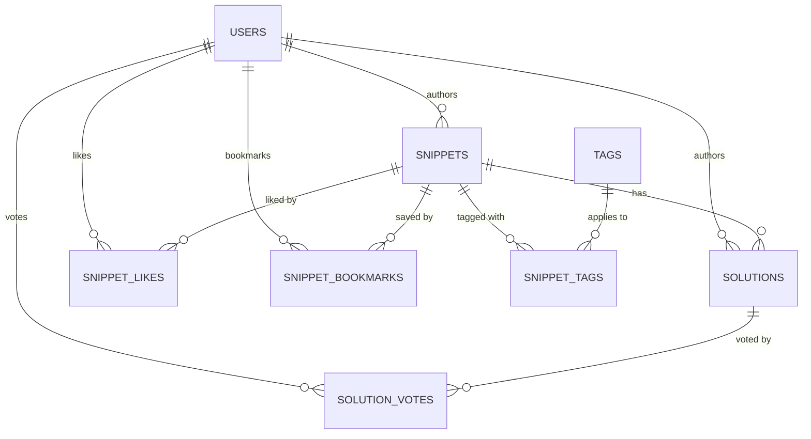

# Database Schema Analysis

This document outlines the proposed database schema required to support the frontend application located in [web](file:///home/llyam/lab/projects/code-snippets/web). The analysis is based on the data models defined in [types.ts](file:///home/llyam/lab/projects/code-snippets/web/src/app/shared/types.ts), the state management in [catalog.service.ts](file:///home/llyam/lab/projects/code-snippets/web/src/app/core/state/catalog.service.ts), and the seed data in [seed-data.ts](file:///home/llyam/lab/projects/code-snippets/web/src/app/shared/seed-data.ts).

---

## Required Tables

### 1. `users`
Represents application users. Derived from the `User` interface in [types.ts](file:///home/llyam/lab/projects/code-snippets/web/src/app/shared/types.ts#L1-L9).

| Column Name | Data Type | Constraints | Description |
| :--- | :--- | :--- | :--- |
| `id` | `UUID` / `VARCHAR(50)` | `PRIMARY KEY` | Unique identifier for each user |
| `name` | `VARCHAR(100)` | `NOT NULL` | The display name of the user |
| `handle` | `VARCHAR(50)` | `NOT NULL`, `UNIQUE` | User's handle (e.g. `ada_lovelace` without the `@`) |
| `email` | `VARCHAR(255)` | `NOT NULL`, `UNIQUE` | User's email address used for auth |
| `avatar` | `TEXT` | `NULL` | URL of the user's avatar image |
| `reputation` | `INTEGER` | `DEFAULT 0`, `NOT NULL` | Gamification reputation score |
| `role` | `VARCHAR(20)` | `CHECK (role IN ('frontend', 'backend', 'fullstack', 'devops', ''))` | Developer specialization role |
| `level` | `VARCHAR(50)` | `NULL` | Developer rank/level (e.g. `Elite Rank`) |
| `created_at` | `TIMESTAMP` | `DEFAULT CURRENT_TIMESTAMP` | Record creation timestamp |
| `updated_at` | `TIMESTAMP` | `DEFAULT CURRENT_TIMESTAMP` | Record update timestamp |

### 2. `snippets`
Represents snippets or bug reports posted by users. Derived from the `Snippet` interface in [types.ts](file:///home/llyam/lab/projects/code-snippets/web/src/app/shared/types.ts#L27-L48).

| Column Name | Data Type | Constraints | Description |
| :--- | :--- | :--- | :--- |
| `id` | `UUID` / `VARCHAR(50)` | `PRIMARY KEY` | Unique identifier for each snippet |
| `title` | `VARCHAR(255)` | `NOT NULL` | Title of the snippet or bug description |
| `description` | `TEXT` | `NOT NULL` | In-depth description of the snippet / bug |
| `code` | `TEXT` | `NOT NULL` | The actual code block |
| `language` | `VARCHAR(50)` | `NOT NULL` | Programming language (e.g. `typescript`, `tsx`) |
| `author_id` | `UUID` / `VARCHAR(50)` | `FOREIGN KEY REFERENCES users(id)` | User who posted the snippet |
| `type` | `VARCHAR(10)` | `CHECK (type IN ('bug', 'snippet'))` | Category of the code post |
| `likes_count` | `INTEGER` | `DEFAULT 0` | Denormalized count of likes for performance |
| `solutions_count` | `INTEGER` | `DEFAULT 0` | Denormalized count of solutions/comments |
| `created_at` | `TIMESTAMP` | `DEFAULT CURRENT_TIMESTAMP` | Time created |
| `updated_at` | `TIMESTAMP` | `DEFAULT CURRENT_TIMESTAMP` | Time updated |

> [!NOTE]
> In the frontend, the `author` field is nested with reputation and username. In the database, this is normalized via a join on `author_id` to the `users` table.

### 3. `solutions`
Represents suggested fixes/solutions submitted for snippets (particularly bugs). Derived from the `Solution` interface in [types.ts](file:///home/llyam/lab/projects/code-snippets/web/src/app/shared/types.ts#L11-L25).

| Column Name | Data Type | Constraints | Description |
| :--- | :--- | :--- | :--- |
| `id` | `UUID` / `VARCHAR(50)` | `PRIMARY KEY` | Unique identifier for each solution |
| `snippet_id` | `UUID` / `VARCHAR(50)` | `FOREIGN KEY REFERENCES snippets(id) ON DELETE CASCADE` | Snippet being answered |
| `author_id` | `UUID` / `VARCHAR(50)` | `FOREIGN KEY REFERENCES users(id)` | Author of the solution |
| `content` | `TEXT` | `NOT NULL` | Description of the solution |
| `code` | `TEXT` | `NULL` | Optional code block associated with the solution |
| `votes` | `INTEGER` | `DEFAULT 0` | Denormalized score (upvotes minus downvotes) |
| `accepted` | `BOOLEAN` | `DEFAULT FALSE` | True if the snippet author accepted this fix |
| `created_at` | `TIMESTAMP` | `DEFAULT CURRENT_TIMESTAMP` | Time created |
| `updated_at` | `TIMESTAMP` | `DEFAULT CURRENT_TIMESTAMP` | Time updated |

### 4. `tags`
Stores unique tags available in the system (e.g., `react`, `typescript`). Derived from the `Tag` interface in [types.ts](file:///home/llyam/lab/projects/code-snippets/web/src/app/shared/types.ts#L65-L68).

| Column Name | Data Type | Constraints | Description |
| :--- | :--- | :--- | :--- |
| `id` | `SERIAL` / `INTEGER` | `PRIMARY KEY` | Unique tag ID |
| `name` | `VARCHAR(50)` | `NOT NULL`, `UNIQUE` | Lowercase tag name (e.g., `react`) |
| `created_at` | `TIMESTAMP` | `DEFAULT CURRENT_TIMESTAMP` | Timestamp created |

### 5. `snippet_tags` (Junction Table)
Many-to-many relationship mapping snippets to their tags.

| Column Name | Data Type | Constraints | Description |
| :--- | :--- | :--- | :--- |
| `snippet_id` | `UUID` / `VARCHAR(50)` | `FOREIGN KEY REFERENCES snippets(id) ON DELETE CASCADE` | Part of compound Primary Key |
| `tag_id` | `INTEGER` | `FOREIGN KEY REFERENCES tags(id) ON DELETE CASCADE` | Part of compound Primary Key |

### 6. `snippet_likes` (Junction Table)
Many-to-many relationship tracking which users have liked which snippets. Used to toggle user likes and compute `isLikedByMe` in the frontend.

| Column Name | Data Type | Constraints | Description |
| :--- | :--- | :--- | :--- |
| `user_id` | `UUID` / `VARCHAR(50)` | `FOREIGN KEY REFERENCES users(id) ON DELETE CASCADE` | User liking the snippet |
| `snippet_id` | `UUID` / `VARCHAR(50)` | `FOREIGN KEY REFERENCES snippets(id) ON DELETE CASCADE` | The liked snippet |
| `created_at` | `TIMESTAMP` | `DEFAULT CURRENT_TIMESTAMP` | When it was liked |

### 7. `snippet_bookmarks` (Junction Table)
Many-to-many relationship tracking saved/bookmarked snippets for a user (`isSavedByMe`).

| Column Name | Data Type | Constraints | Description |
| :--- | :--- | :--- | :--- |
| `user_id` | `UUID` / `VARCHAR(50)` | `FOREIGN KEY REFERENCES users(id) ON DELETE CASCADE` | User saving the snippet |
| `snippet_id` | `UUID` / `VARCHAR(50)` | `FOREIGN KEY REFERENCES snippets(id) ON DELETE CASCADE` | The saved snippet |
| `created_at` | `TIMESTAMP` | `DEFAULT CURRENT_TIMESTAMP` | When it was saved |

### 8. `solution_votes` (Junction Table with Payload)
Tracks votes by users on solutions (`voted?: 'up' | 'down' | null`). Prevents users from voting multiple times and tracks their vote status.

| Column Name | Data Type | Constraints | Description |
| :--- | :--- | :--- | :--- |
| `user_id` | `UUID` / `VARCHAR(50)` | `FOREIGN KEY REFERENCES users(id) ON DELETE CASCADE` | Voter |
| `solution_id` | `UUID` / `VARCHAR(50)` | `FOREIGN KEY REFERENCES solutions(id) ON DELETE CASCADE` | Voted solution |
| `vote_type` | `VARCHAR(10)` | `CHECK (vote_type IN ('up', 'down'))` | Vote direction |
| `created_at` | `TIMESTAMP` | `DEFAULT CURRENT_TIMESTAMP` | When voted |

---

## Key Design Decisions & Recommendations

1. **Denormalization vs. Joins**: 
   Fields like `likes_count` and `solutions_count` on `snippets`, and `votes` on `solutions`, are cached directly on the primary records in the frontend model. Under heavy traffic, keeping these synchronized with the junction tables (`snippet_likes` & `solution_votes`) via database triggers or transaction logic is highly recommended.
   
2. **Soft Deletes**: 
   Consider implementing `deleted_at` timestamps on `snippets` and `solutions` so that referenced foreign keys remain intact even if contents are removed by the author.
